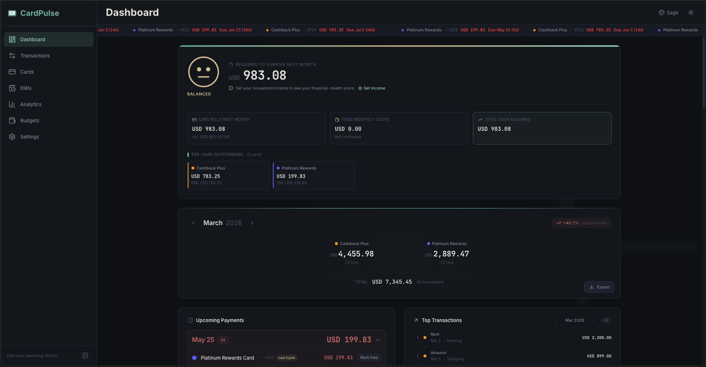
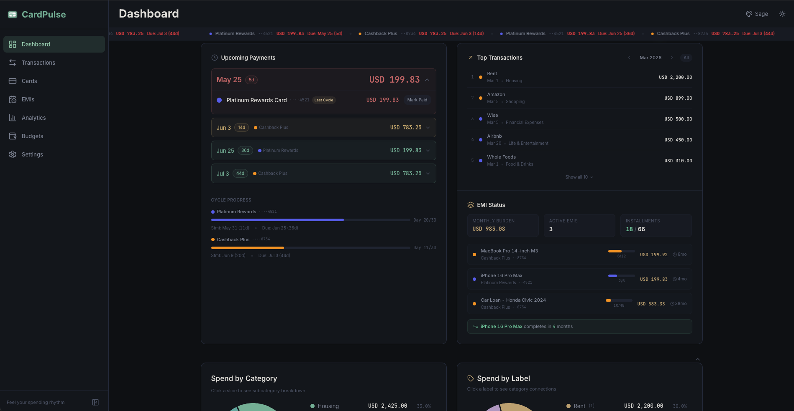
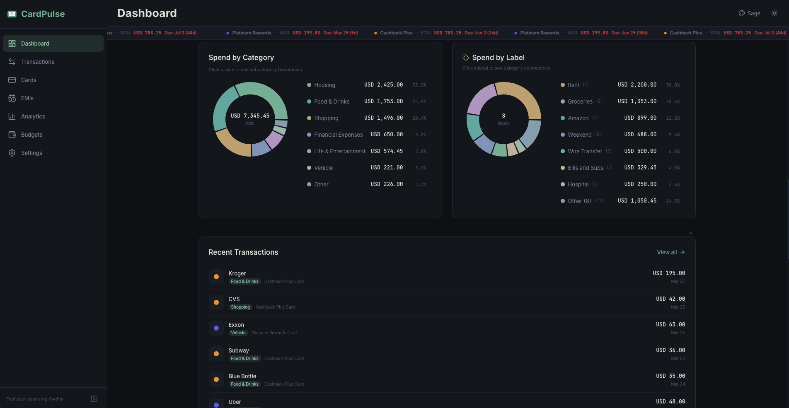
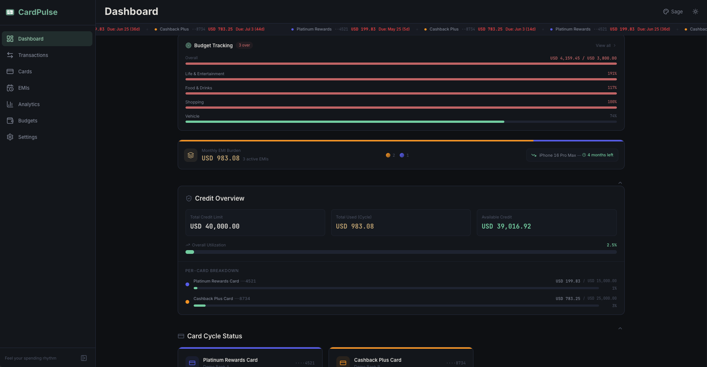
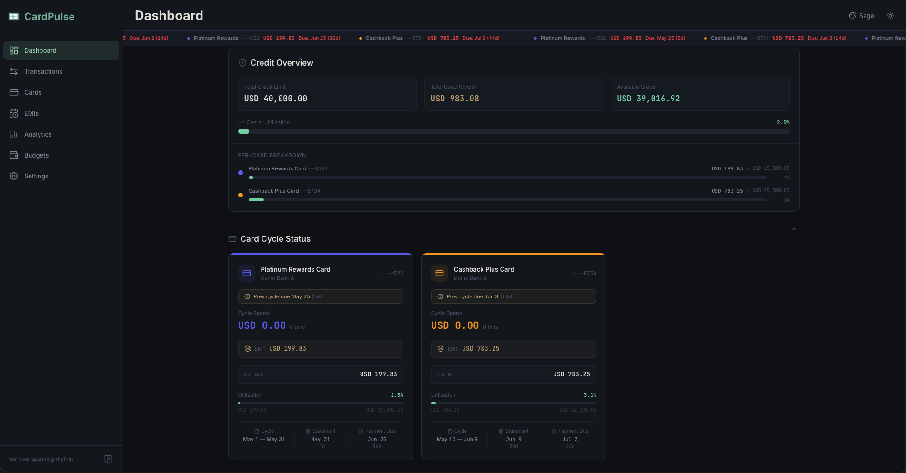

<div align="center">

<a href="../README.md">
  
</a>

## CardPulse Documentation

<sub><a href="../README.md">← Back to overview</a></sub>

</div>

---

# 📊 02: Dashboard Guide

> The CardPulse dashboard is a **single-glance financial command center** — everything from the financial-health pulse and payment due dates to credit utilization, spending breakdowns and card cycles, all in one scrollable view.



---

## 📑 Table of Contents

- 🌐 [Overview](#-overview)
- 📢 [Payment Ticker](#-payment-ticker)
- 💚 [Financial Health Card](#-financial-health-card)
- 🏆 [Monthly Hero Card](#-monthly-hero-card)
- 💸 [Upcoming Payments](#-upcoming-payments)
- 🔝 [Top Transactions & EMI Status](#-top-transactions--emi-status)
- 🍩 [Category & Label Donuts](#-category--label-donuts)
- 📋 [Recent Transactions](#-recent-transactions)
- 📏 [Budget Strip](#-budget-strip)
- 🔄 [EMI Summary](#-emi-summary)
- 💳 [Credit Overview](#-credit-overview)
- 🏦 [Card Cycle Status](#-card-cycle-status)
- 📐 [Collapsible Sections](#-collapsible-sections)

---

## 🌐 Overview

The dashboard is structured in **layers of priority** — the things you need to act on are at the top, exploratory views are collapsed below.

| Layer | Sections | Visibility |
|:-----:|:---------|:-----------|
| 🟢 **Always visible (top)** | Financial Health, Monthly Hero, Upcoming Payments, Top Transactions & EMI Status | Fixed at top |
| 🟡 **Collapsible** | Donuts, Recent Txns, Budgets, EMIs, Credit, Card Cycles | Click to expand |

Data refreshes automatically on page load. The **month navigator** on the Monthly Hero (← Mar 2026 →) drives the period for the hero, donuts, recent transactions and budget strip. Forward-looking sections (Upcoming Payments, Credit Overview, Card Cycle Status) always reflect **today**.

---

## 📢 Payment Ticker

A **scrolling marquee** in the header bar that keeps you aware without taking focus:

- 🔴 **Card payments** — Each card's estimated bill with due-date countdown
  - Unpaid cards glow in neon red
  - Paid cards display in calm green
- 🏷️ **Top spends** — Your highest-spending labels for the current month
  - Label names in periwinkle
  - Amounts in sand

> 📱 **Hidden on mobile** to save screen space. Refreshes every 5 minutes and silently handles API failures — if the server is momentarily unreachable, the ticker simply pauses.

---

## 💚 Financial Health Card

The very first thing you see on the dashboard. It collapses the question *"can I afford next month?"* into one number and one face.


### 🧮 What the number means

```
Required to survive next month = next-cycle card bills + monthly fixed costs
```

It is **not** your typical monthly spend. It is the floor — what you must keep flowing to stay current on installments, pay your card bills in full and cover the recurring obligations you've declared as fixed costs.

### 🎭 The mood face

The face shows the ratio of that floor to your **monthly household income** (configured in Settings → General). Six levels from healthiest to most distressed:

| Mood | Label | Ratio | Meaning |
|:----:|:------|:-----:|:--------|
| 😄 | Thriving    | < 30 %       | Plenty of breathing room |
| 🙂 | Comfortable | 30 – 50 %    | You're in good shape |
| 😐 | Balanced    | 50 – 70 %    | Manageable, but watch new debt |
| 😟 | Tight       | 70 – 90 %    | Margins are tight |
| 😢 | Stretched   | 90 – 100 %   | Almost no buffer left |
| 😭 | Underwater  | > 100 %      | Commitments exceed income |

If income is not set, the face appears in a neutral state with a **"Set income"** link to Settings → General → Household Income.

### 📊 The three boxes

- **Card bills next month** — sum of the next-cycle estimated bills across all cards (includes outstanding cycle spend + EMI installments hitting that cycle)
- **Fixed monthly costs** — sum of every active row on the Fixed Costs settings page
- **Total cash required** — the sum of the above two; the headline number above repeats this for emphasis

### 💳 Per-card outstanding

Below the boxes, a compact grid breaks the card-bills figure down per card — name, color dot, last-four, the estimated bill, and if applicable an `EMI: USD X` sub-line so you can see how much of the bill is locked-in installments versus this cycle's discretionary spend.

> 📖 Deep dive: [13: Financial Health Card](./13-Financial-Health.md)

---

## 🏆 Monthly Hero Card

The main summary at the top of the dashboard — your month at a glance.

### 💳 Per-Card Breakdown

Instead of a single total, the hero card shows each card's spending in a **responsive grid**:

| # Cards | Layout |
|:-------:|:-------|
| 0       | Centered zero figure |
| 1       | Single centered card column |
| 2       | Two-column grid |
| 3–5     | Responsive 3 / 4 / 5-column grid |

Each card column displays:
- 🎨 **Color dot** matching the card's assigned color
- 🏷️ **Card name** (the trailing " Card" is dropped for brevity)
- 💰 **Animated amount** (CountUp animation, JetBrains Mono font)
- 🔢 **Transaction count** for the month

> ➕ When 2+ cards have data, a **total line** appears: `TOTAL USD X,XXX.XX · Y transactions`

### 📅 Month Navigation

- ⬅️ ➡️ Use arrow buttons to browse months
- 🚫 Right arrow is disabled when viewing the current month
- 📈 A **percentage badge** shows month-over-month change (green ↓ for decrease, red ↑ for increase)

### 📤 Export

A subtle **Export** button at the bottom-right opens the report modal — see [09: Export Reports](./09-Export-Reports.md).

---

## 💸 Upcoming Payments

The **left card** in the second always-visible row shows payment due dates grouped by date.



### 📋 Collapsed View
- 📅 Due date + countdown badge (e.g., `5d`, `14d`, `36d`)
- 💰 Total amount due across all cards on that date

### 📂 Expanded View (click to toggle)
- 💳 Individual card rows with amounts
- ✅ **Mark Paid** button per card
- 🏷️ "Last Cycle" / "Current Cycle" badges to show which billing period the payment closes

### 🎨 Urgency Color Coding

| Condition | Color | Meaning |
|:---------:|:-----:|:--------|
| ≤ 5 days  | 🔴 Red    | Payment due very soon |
| ≤ 14 days | 🟡 Gold   | Payment approaching |
| Marked paid | 🟢 Green | All settled |

### 📊 Cycle Progress

Below the payment groups, **per-card progress bars** show:
- 📏 Day X of Y in the current billing cycle
- 📄 Days until statement generation
- 💸 Days until payment due date
- Red highlight when ≤ 5 days to due, gold when ≤ 14 days

---

## 🔝 Top Transactions & EMI Status

The **right card** in the always-visible row contains two stacked sections.

### 🏅 Top Transactions

The **10 largest transactions** ranked by amount:

| Column        | Details |
|:--------------|:--------|
| 🥇 Rank       | Position number (1–10) |
| 🎨 Card dot   | Color-coded to the card |
| 🏪 Merchant   | Description or merchant name |
| 📅 Date + Category | When and what type |
| 💰 Amount     | JetBrains Mono, right-aligned |

**🗓️ Independent month picker:** An `[‹] Mar 2026 [›] [All]` control lets you browse different months or view **all-time** top transactions. The picker syncs with the main month navigator until you manually override it.

### 📦 EMI Status

Visible when active EMIs exist:
- 💰 **Monthly burden** — Total EMI amount across all cards
- 🔢 **Active count** — Number of installment plans
- 📊 **Progress** — Per-EMI rows with progress bars (green at ≥ 75 % completion)
- 🏁 **Next completing** — Highlights the EMI closest to finishing

---

## 🍩 Category & Label Donuts

Two **side-by-side interactive donut charts** in the first collapsible section.



### 🥧 Category Donut (left)

- 📊 Top 6 spending categories + "Other"
- 👆 **Click any slice** to drill into the subcategory breakdown
- ⬅️ A **Back** button returns to the main category view
- 🏷️ In drill-down mode, connected labels appear as chips below the chart
- 🎯 Center displays the total amount

### 🏷️ Label Donut (right)

- 📊 Top 7 labels + "Other" with a distinct sand/lavender palette
- 👆 **Click any label** to see which categories it connects to
- 🔢 Shows transaction count per label in the legend

> 📈 **Want more detail?** Visit the [Analytics page](./06-Analytics-Deep-Dive.md) for trends, comparisons, and deep breakdowns.

---

## 📋 Recent Transactions

A compact list of the **last 10 transactions** showing:
- 📅 Date (formatted per your settings)
- 📝 Description and merchant
- 💰 Amount (monospace font, right-aligned)
- 🏷️ Category / subcategory badges
- 💳 Card badge (color-coded)

The same screenshot above (Spend by Category and Label) shows the recent transactions list immediately underneath the donuts.

---

## 📏 Budget Strip

A quick-reference bar showing **budget progress per category**, plus an EMI burden line and credit overview teaser.



| Utilization | Color | Meaning |
|:-----------:|:-----:|:--------|
| < 75 %  | 🟢 Green | On track |
| 75–100 % | 🟡 Gold | Approaching limit |
| > 100 % | 🔴 Red | Over budget |

A small `3 over` chip in the header surfaces how many categories are in the red — clicking through opens the full [Budgets](./07-Budgets.md) page.

---

## 🔄 EMI Summary

The same screenshot shows a compact strip:
- 💰 **Total monthly EMI burden** across all cards
- 🔢 **Count** of active EMIs
- 🏁 **Next completing** — e.g., "iPhone 16 Pro Max · 4 months left"
- 🎯 A pair of dots reflects the cycle each EMI is currently in

> 📖 See [05: EMI Tracker](./05-EMI-Tracker.md) for full EMI management and [12: Survival Summary](./12-Survival-Summary.md) for the multi-month closure projection.

---

## 💳 Credit Overview

Aggregated **credit utilization** across all cards in a collapsible section.



### 📊 Summary Row

| Metric | Description |
|:-------|:------------|
| 🏦 **Total Credit Limit** | Sum of all card limits |
| 📉 **Total Used**         | Current cycle spend + EMI installments |
| 💚 **Available Credit**   | Limit minus used |

### 🎨 Utilization Thresholds

| Utilization | Color | Visual Effect |
|:-----------:|:-----:|:-------------|
| < 75 %  | 🟢 Green | Normal display |
| 75–100 % | 🟡 Gold | Gold progress bar + warning text |
| ≥ 100 % | 🔴 Red  | Red danger glow + warning banner |

### 💳 Per-Card Breakdown
Individual progress bars showing each card's usage versus its credit limit, with last-four for disambiguation.

---

## 🏦 Card Cycle Status

Detailed billing cycle cards for each active credit card (collapsible section). The same screenshot above shows two cards side-by-side.

Each card shows:
- 🏷️ Card name, bank, last 4 digits
- 📅 Current cycle date range (e.g., *May 1 → May 31*)
- 📊 **Purchases vs EMI breakdown** (cycle spend + EMI installments → estimated bill)
- 📏 Utilization percentage bar with danger / warning highlighting
- ⏰ **Cycle / Statement / Payment Due** — three timestamped pills along the bottom

> ⚠️ Cards with high utilization (≥ 75 %) get **gold borders**; over-limit cards (≥ 100 %) get a **red danger glow**.

---

## 📐 Collapsible Sections

Sections below the always-visible top get a **collapsible** wrapper. State persists per-section in localStorage, so the next visit opens with your last layout.

| Section | Default State |
|:--------|:-------------|
| 🍩 Category & Label Donuts | Collapsed |
| 📋 Recent Transactions     | Collapsed |
| 📏 Budget Strip            | Collapsed |
| 🔄 EMI Summary             | Collapsed |
| 💳 Credit Overview         | Collapsed |
| 🏦 Card Cycle Status       | Collapsed |

👆 **Click any section header** to expand or collapse. This keeps the dashboard clean and focused while giving you access to everything in one place.

---

← Previous: [01: Getting Started](./01-Getting-Started.md) | → Next: [03: Transaction Entry](./03-Transaction-Entry.md)
