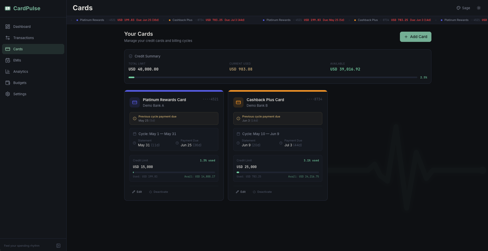

<div align="center">

<a href="../README.md">
  
</a>

## CardPulse Documentation

<sub><a href="../README.md">← Back to overview</a></sub>

</div>

---

# 💳 04: Card Management

> Credit cards are at the heart of CardPulse. Each card carries its own billing cycle, credit limit, NLP aliases, and color identity — making it easy to track spending, utilization, and payments across your entire portfolio.



The page leads with a **Credit Summary** banner across the top — total credit limit, current usage and available credit aggregated across every active card — then renders each card as a passport-sized panel with its current cycle, statement date, due date, credit limit and utilisation bar.

---

## 📑 Table of Contents

- 🌐 [Overview](#-overview)
- ➕ [Adding a Card](#-adding-a-card)
- 📋 [Card Fields](#-card-fields)
- 🔄 [Understanding Billing Cycles](#-understanding-billing-cycles)
- 📊 [Credit Utilization Tracking](#-credit-utilization-tracking)
- 🧠 [Card Aliases for NLP](#-card-aliases-for-nlp)
- 🚫 [Deactivating Cards](#-deactivating-cards)
- 🗺️ [Where Cards Appear](#️-where-cards-appear)

---

## 🌐 Overview

The Cards page (`/cards`) shows all registered credit cards as **visual card-shaped displays**. Active cards appear in the main grid; inactive cards are tucked away in a collapsed section below.

Each card display shows at a glance:
- 🏷️ Card name, bank, and last 4 digits
- 📅 Current billing cycle date range
- ⏰ Days until statement and due date
- 📊 Spending breakdown (purchases + EMIs = estimated bill)
- 📏 Credit utilization bar (when a credit limit is set)
- 🚨 Due date alerts with urgency colors

---

## ➕ Adding a Card

Click the **+ Add Card** button at the top-right of the Cards page. A side-sheet slides in with the card form.

### The flow, step by step

1. **Name** the card — this becomes its display name across the app *and* the auto-created label for filtering. Pick something that reads well in tight UI (`Cashback Plus`, not `My Bank Cashback Plus Premium Mastercard`).
2. **Bank** — the issuing bank's name. Used in the secondary line under the card title and in default aliases.
3. **Last 4 digits** (optional) — if filled, displayed as `··· 4521` for at-a-glance disambiguation when you have multiple cards from the same bank.
4. **Cycle Start / End days** — the days of the month your billing cycle opens and closes. See [Understanding Billing Cycles](#-understanding-billing-cycles) for the math.
5. **Statement day** — the day the bank publishes your statement (usually equal to or one day after cycle end).
6. **Due day** — the day payment is due. The relative position to statement day determines whether due falls in the same or next month (see the cycle table below).
7. **Credit limit** (optional) — enables utilisation tracking. If you leave it blank, utilisation bars and danger thresholds simply don't render for this card.
8. **Color** — the accent colour used everywhere this card appears (dots, badges, chart bars, borders). Pick distinguishable colours when you have multiple cards.
9. **Aliases** (optional) — comma-separated short names the NLP parser will recognise. If blank, defaults are auto-generated from the name and bank.

Click **Save**. The card appears immediately on the Cards page and starts collecting data.

### What CardPulse does behind the scenes

When you create a card, the app **automatically**:

1. 🏷️ Creates a matching **label** in the labels table (e.g., `Cashback Plus Card`) so you can filter / chart by card without setting that up separately.
2. 🧠 Generates **default aliases** from the card name and bank name for NLP matching (e.g., `cashback`, `cashback plus`, `cashback plus card`, `demo bank b`).
3. 📅 Pre-computes the **current cycle window** so the dashboard, ticker and EMI projections all see it immediately.

> 💡 You can customise aliases later in the card edit form. See [Card Aliases for NLP](#-card-aliases-for-nlp) below.

---

## 📋 Card Fields

| Field | Required | Description |
|:------|:--------:|:------------|
| 🏷️ **Name** | ✅ | Unique display name (e.g., `"My Premium Card"`). Also becomes the auto-created label name. |
| 🏦 **Bank** | ✅ | Bank name (e.g., `"Example Bank"`). |
| 🔢 **Last 4 Digits** | ❌ | Last 4 of the card number. Displayed as `···XXXX`. Must be exactly 4 digits if provided. |
| 📅 **Cycle Start Day** | ✅ | Day of month (1–31) when the billing cycle begins. |
| 📅 **Cycle End Day** | ✅ | Day of month (1–31) when the billing cycle ends. Use `31` for "last day of month." |
| 📄 **Statement Day** | ✅ | Day the bank generates the monthly statement. |
| 💸 **Due Day** | ✅ | Day payment is due after statement generation. |
| 💰 **Credit Limit** | ❌ | Maximum credit in your configured currency. Enables utilization tracking when set. |
| 🎨 **Color** | ✅ | Hex color used across the app — charts, badges, borders, dots. |
| 🧠 **Aliases** | ❌ | Comma-separated short names for NLP matching (e.g., `"mycard, premium, my bank"`). |

---

## 🔄 Understanding Billing Cycles

Billing cycles define **when charges accumulate** and **when payment is due**.

### 📅 How `cycle_start` and `cycle_end` Work

| Setting | Meaning | Example |
|:--------|:--------|:--------|
| `cycle_start = 10` | Charges begin accumulating on the 10th | 10th Jan |
| `cycle_end = 9` | Cycle closes on the 9th of the next month | 9th Feb |
| **Result** | One full billing period | Jan 10 → Feb 9 |

### 📏 Month-Length Capping

CardPulse handles months with different lengths automatically:

> ⚠️ **If `cycle_end` is 31**, the app caps to the actual last day of the month:
> - 📅 February → 28th (or 29th in leap years)
> - 📅 April, June, September, November → 30th
> - 📅 All other months → 31st
>
> Same capping applies to `cycle_start` — no month will try to start on a day that doesn't exist.

### 📄 Statement & Due Date Logic

The statement and due date follow a **fixed relationship**:

```
📄 Statement generated on statement_day (at cycle end)
         │
         ▼
💸 Payment due on due_day (fixed gap after statement)
```

| Condition | Due Date Timing | Example |
|:----------|:----------------|:--------|
| `due_day > statement_day` | Due in the **same month** as statement | Card E: statement 1st → due 26th (same month) |
| `due_day ≤ statement_day` | Due in the **next month** after statement | Card B: statement 31st → due 25th (next month) |

> 💡 **Examples:**
>
> | Card | Statement | Due | Gap |
> |:-----|:---------:|:---:|:---:|
> | 🔵 Card A | 9th | 3rd (next month) | 25 days |
> | 🟡 Card B | 31st | 25th (next month) | 25 days |
> | 🟢 Card C | 31st | 25th (next month) | 25 days |
> | 🟣 Card D | 23rd | 19th (next month) | 27 days |
> | 🔵 Card E | 1st | 26th (same month) | 25 days |

---

## 📊 Credit Utilization Tracking

When a **credit limit** is set on a card, CardPulse tracks utilization across the app with consistent color thresholds:

| Utilization | Color | Visual Effect |
|:-----------:|:-----:|:-------------|
| < 75% | 🟢 **Green** | Normal display, healthy usage |
| 75–100% | 🟡 **Gold** | Gold border on card, gold progress bar, warning text |
| ≥ 100% | 🔴 **Red** | Red danger glow, red border, alert triangle icon |

### 📐 Calculation

```
Utilization % = (Cycle Purchases + EMI Installments) / Credit Limit × 100
```

> 💡 **Both purchases and EMIs count.** A card with 1,000 in cycle purchases and 500 in EMI installments against a 2,000 credit limit shows 75 % utilisation (gold warning).

> ⚠️ **No credit limit set?** The utilization bar and thresholds are hidden entirely for that card. Set a limit in the card edit form to enable tracking.

---

## 🧠 Card Aliases for NLP

Aliases are **short names** that the NLP parser recognizes when you use Quick Add. For example, typing `"premium"` matches **My Premium Card** because `"premium"` is one of its aliases.

### 📝 How Aliases Work

- 🔧 **Default aliases** are auto-generated from the card name and bank name when you create a card
- ✏️ **Customize** them in the card edit form as a comma-separated list
- 🎯 **Format:** `premium, premium card, my bank, my bank card`

### ⚠️ Ambiguity Rules

The parser prioritizes **accuracy over guessing**:

| Situation | Parser Behavior |
|:----------|:---------------|
| 🎯 `"premium rewards"` → matches only one card | ✅ Auto-assigns card |
| 🎯 `"travel"` → matches only one card | ✅ Auto-assigns card |
| ⚠️ `"cashback"` → could match 2 cards with that alias | ❌ No auto-assign, you pick |
| ⚠️ `"bank name"` → could match multiple cards at same bank | ❌ No auto-assign, you pick |

> 🛡️ **Rule of thumb:** More specific aliases always win. If an alias is ambiguous (could match 2+ cards), the parser won't guess — the Card dropdown stays at "None (Cash/Bank)" and you select manually.

See [Transaction Entry](./03-Transaction-Entry.md) for details on how card matching fits into the full NLP pipeline.

---

## 🚫 Deactivating Cards

Instead of deleting cards (which would orphan transactions), you can **deactivate** them:

1. 🔄 Click the toggle on a card display, or edit the card and uncheck "Active"
2. 📁 Inactive cards move to the **"Inactive Cards"** section (collapsed by default)
3. 🚫 Inactive cards **don't appear** in:
   - Transaction form dropdowns
   - NLP card matching
   - Dashboard active card displays
4. 📊 All **historical transactions and analytics** are preserved

> 💡 **Reactivate anytime** — toggle the card back to active and it reappears everywhere.

---

## 🗺️ Where Cards Appear

Cards are referenced **throughout** the CardPulse app:

| Location | How Cards Are Shown |
|:---------|:-------------------|
| 🏠 **Dashboard — Hero** | Per-card spend columns with color dots |
| 💸 **Dashboard — Payments** | Due dates and amounts per card |
| 📊 **Dashboard — Credit Overview** | Utilization bars per card |
| 🔄 **Dashboard — Cycle Status** | Full cycle detail per card |
| 📝 **Transaction Form** | Card dropdown with color dots |
| 📃 **Transaction List** | Card badge on each row |
| 📈 **Analytics — Cards tab** | Grouped bars or individual area charts |
| ⏱️ **Analytics — Cycles tab** | 3-cycle timeline per card |
| 📦 **EMI Tracker** | EMIs grouped by card |
| 🧠 **NLP Parser** | Card aliases for auto-detection |
| 📢 **Payment Ticker** | Scrolling due date alerts per card |

---

← Previous: [Transaction Entry](./03-Transaction-Entry.md) | → Next: [EMI Tracker](./05-EMI-Tracker.md)
