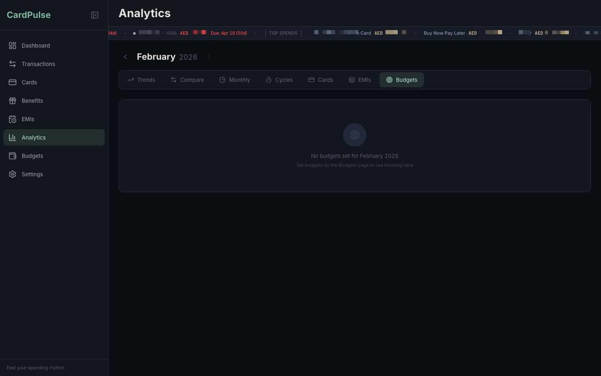

# 📊 06: Analytics Deep Dive

> Seven powerful tabs to slice, compare, and visualize your spending data from every angle.

---

## 📑 Table of Contents

- [Overview](#-overview)
- [1. Trends](#1--trends)
- [2. Compare](#2--compare)
- [3. Monthly Drilldown](#3--monthly-drilldown)
- [4. Cycles](#4--cycles)
- [5. Cards](#5--cards)
- [6. EMIs](#6--emis)
- [7. Budgets](#7--budgets)
- [Chart Design Principles](#-chart-design-principles)

---

## 🗺️ Overview

The Analytics page (`/analytics`) offers **7 tabs**, each providing a different lens on your financial data:

| # | Tab | Icon | Purpose |
|---|-----|------|---------|
| 1 | **Trends** | 📈 TrendingUp | Spending patterns over time |
| 2 | **Compare** | ↔️ ArrowLeftRight | Month-vs-month analysis |
| 3 | **Monthly** | 🥧 PieChart | Category & label breakdown |
| 4 | **Cycles** | ⏱️ Timer | Billing cycle timeline |
| 5 | **Cards** | 💳 CreditCard | Per-card spending history |
| 6 | **EMIs** | 📦 Layers | Installment plan landscape |
| 7 | **Budgets** | 🎯 Target | Budget vs actual progress |

A global **month navigator** (`← Month Year →`) controls the time period for most tabs. The **Compare** tab has its own independent month pickers, and the month navigator hides when Compare is active.

**Default tab:** Trends (opens on page load).

---

## 1. 📈 Trends

> *Where is my money going over time?*

The Trends tab is organized into **three sections**, each with a row of **insight stat cards** followed by an **interactive area chart** with an in-chart dropdown selector.


---

### 🟢 Section 1: Overall Spending (Sage Green)

**Insight Cards (3-card row):**

| Card | What It Shows |
|------|--------------|
| 💰 **Latest Month** | Total spending for the most recent month with data |
| 📊 **Average Monthly** | Average monthly spending across all tracked months |
| 📅 **Months Tracked** | Count of months from your first to last transaction |

**Area Chart:** Total spending trend over up to 12 months. Single sage-green series with gradient fill — no overlapping categories.


---

### 🔵 Section 2: Category Spending (Seafoam)

**Insight Cards (3-card row):**

| Card | What It Shows |
|------|--------------|
| 📂 **Most Spent Category** | Highest-spending category in the latest month |
| 🔺 **Biggest Gainer** | Category with the largest % increase month-over-month (shown in red) |
| 🔻 **Biggest Saver** | Category with the largest % decrease (shown in green) |

**Area Chart:** Category spending trend with an **in-chart dropdown** selector. Options include:

- 🔹 **All Categories** — shows total spending (default)
- 🔹 **Individual categories** — select any category to see its isolated trend


#### 🔍 Subcategory Drill-Down

When a specific category is selected, a **second area chart** appears below (periwinkle `#8B9DC3`) showing subcategory-level trends. This chart has its own dropdown to pick individual subcategories. The subcategory chart resets when you change the parent category.

```
Category dropdown: [Food & Drinks ▾]
   └── Area chart: Food & Drinks over 12 months

       Subcategory dropdown: [All Subcategories ▾]
       └── Area chart: Groceries / Restaurant / Café trends
```

---

### 🟡 Section 3: Label Spending (Sand)

**Insight Cards (3-card row):**

| Card | What It Shows |
|------|--------------|
| 🏷️ **Most Spent Label** | Highest-spending label in the latest month |
| 🔺 **Biggest Gainer** | Label with the largest % increase month-over-month |
| 🔻 **Biggest Saver** | Label with the largest % decrease |

**Area Chart:** Label spending trend with dropdown for individual label selection. Same interaction pattern as the category chart.

---

## 2. ↔️ Compare

> *How does this month stack up against another month?*

The Compare tab has its **own independent month pickers** — the global month navigator is hidden when this tab is active.


---

### 📅 Month Pickers

Two side-by-side pickers with `◀ ▶` navigation:

| Position | Role | Default |
|----------|------|---------|
| **Left** | "Previous" month (Month 1) | One month before current |
| **Right** | "Current" month (Month 2) | Current month |

---

### 📊 Insight Cards (3-card row)

| Card | What It Shows |
|------|--------------|
| 💰 **Spending Change** | Delta amount + percentage (🔴 red for increase, 🟢 green for decrease) |
| 🔢 **Transaction Count** | Number of transactions in each month side-by-side |
| 📐 **Avg per Transaction** | Average transaction amount in each month |

---

### 📊 Category Comparison Bar Chart

Grouped bars showing **Month 1** (sage green) and **Month 2** (periwinkle) side-by-side for each category. Hover tooltips show both values and the total.


---

### 📋 Category Delta Table

An expandable table with color-coded deltas:

| Column | Description |
|--------|-------------|
| 📂 **Item** | Category name (click to expand subcategories) |
| 📅 **Month 2** | Amount in the current/right month |
| 📅 **Month 1** | Amount in the previous/left month |
| 📊 **Delta** | Difference in your currency |
| 📈 **% Change** | Percentage change (🟢 green = saved, 🔴 red = spent more) |

**Click any category row** to expand and see **subcategory-level breakdown** with the same delta columns. This reveals exactly which subcategories drove the spending change.


---

### 🏷️ Label Spending Change

**Horizontal diverging bar chart** showing per-label spending change between the two months:

- 🟢 **Green bars** = spending decreased (savings)
- 🔴 **Red bars** = spending increased
- Sorted by absolute delta (largest changes first)
- Labels with zero change are filtered out

---

## 3. 🥧 Monthly Drilldown

> *Category & label breakdown at a glance.*

Two side-by-side **interactive donut charts** (190px diameter) for the selected month.


---

### 📂 Category Donut (Left)

- Shows spending grouped by main category
- 🖱️ **Click any slice** to drill into subcategory breakdown — the donut redraws with subcategory data
- ◀️ **Back button** returns to the main category view
- In drill-down mode, **connected labels** appear as chips below the chart
- Center displays the **total amount**
- Legend shows amounts and percentages per category

### 🏷️ Label Donut (Right)

- Shows spending grouped by label with a distinct **sand/lavender palette**
- 🖱️ **Click a label** to see which categories it connects to
- Shows **transaction count** per label in the legend
- Center displays the **total amount**

---

## 4. ⏱️ Cycles

> *Track every billing cycle across all your cards.*

A **3-column timeline** for each active credit card, showing the full billing cycle lifecycle.


---

### ◀️ Previous Cycle (Finalized)

| Element | Details |
|---------|---------|
| 📅 **Date Range** | e.g., "Jan 10 – Feb 9, 2026" |
| 🛒 **Purchases** | Total non-EMI expenses in the cycle |
| 📦 **EMI Installments** | Sum of EMI charges for the cycle |
| 📋 **Total Bill** | Purchases + EMIs combined |
| 💳 **Payment Status** | Due date with paid/unpaid indicator |
| 📜 **Event List** | Expandable list of individual transactions and EMIs |

### ▶️ Current Cycle (In-Progress)

| Element | Details |
|---------|---------|
| 📅 **Date Range** | With a "Today" position indicator |
| 💰 **Running Total** | Live sum of expenses + EMIs so far |
| 📈 **Utilization** | Percentage of credit limit used |
| 📜 **Event List** | Expandable list of charges to date |

### ⏭️ Next Cycle (Forecast)

| Element | Details |
|---------|---------|
| 📅 **Date Range** | Upcoming cycle dates |
| 📦 **Confirmed EMIs** | Only EMI installments — no speculative projections |
| 📅 **Due Date** | For planning ahead |

**Visual elements across all columns:**

- 🔴 **Due date alerts** — red highlight when ≤5 days until due, gold when ≤14 days
- 🟠 **Color orbs** sized by amount for visual proportion
- 📊 **Utilization percentage** based on credit limit
- ⚠️ **Cross-cycle alert** — the Next Cycle card prominently shows the *current* cycle's payment due date (the most urgent action item)

---

## 5. 💳 Cards

> *Per-card spending history.*


---

### 💊 Card Selector Pills

A row of selectable buttons at the top of the chart:

| Pill | Behavior |
|------|----------|
| **All Cards** | Default — shows all cards in grouped bar chart |
| **Individual card pills** | Each shows the card's color dot, name (stripped of " Card" suffix), and total spend amount |

### 📊 All Cards Mode

**Grouped bar chart** with all cards side-by-side per month over 12 months. Each card uses its assigned color. Hover tooltip shows all card amounts plus the monthly total.

### 📈 Single Card Mode

Click a specific card pill to switch to an **individual area chart** with gradient fill in the card's assigned color. Shows a single spending trend line over 12 months.


---

## 6. 📦 EMIs

> *Active installment plan landscape.*

Shows all active EMIs in a visual layout:

- 📱 EMI description and assigned card
- 💵 Monthly amount and original purchase price
- 📊 Progress bar (months paid / total months)
- 📅 Expected completion date
- 💳 Grouped by card for easy scanning

For full EMI management (adding, editing, auto-generation), see [EMI Tracker](./05-EMI-Tracker.md).

---

## 7. 🎯 Budgets

> *Budget vs. actual spending.*



Shows budget progress for each category/subcategory with an active budget:

| Element | Description |
|---------|-------------|
| 📂 **Category Name** | The budgeted category (and subcategory if set) |
| 💰 **Budget Amount** | Monthly spending limit |
| 📊 **Progress Bar** | Visual fill with threshold colors |
| 🔢 **Actual vs Budget** | e.g., "AED 496 / AED 800" |
| 📈 **Percentage** | e.g., "62% spent" |

**Threshold colors:**

| Utilization | Color | Meaning |
|-------------|-------|---------|
| < 75% | 🟢 Green | On track |
| 75–100% | 🟡 Gold | Approaching limit |
| ≥ 100% | 🔴 Red | Over budget |

For setting up and managing budgets, see [Budgets](./07-Budgets.md).

---

## 🎨 Chart Design Principles

All charts across CardPulse follow these consistent design rules:

| Principle | Implementation |
|-----------|---------------|
| 📊 **Single series per chart** | Use dropdowns to switch between categories/labels — never overlay multiple series in one chart |
| 📐 **Dynamic Y-axis** | `niceYDomain()` computes clean round-number tick marks (e.g., 0–5k, 0–15k, 0–20k) that adapt to data range |
| 📱 **Responsive sizing** | Aspect-ratio-based height (2.5:1 or 2.8:1) with `minHeight: 220px` and `maxHeight: 380px` — no fixed pixel heights |
| 🎨 **Consistent styling** | Horizontal dashed grid lines at 50% opacity, no vertical grid, muted axis labels, monotone curve interpolation |
| 🌈 **Gradient fills** | Area charts use gradient fills from 20% opacity at the top to 0% at the bottom |
| 🎭 **Theme-aware colors** | All chart colors read from CSS variables, updating instantly on theme switch |
| 💬 **Shared tooltips** | Consistent tooltip design across all charts — colored dot + name + amount, with optional total row |
| 🔤 **Formatted axes** | Y-axis shows `AED 0`, `AED 5k`, `AED 10k` etc. via `formatYAxis()` utility |

---

| | |
|---|---|
| ← Previous: [EMI Tracker](./05-EMI-Tracker.md) | → Next: [Budgets](./07-Budgets.md) |
