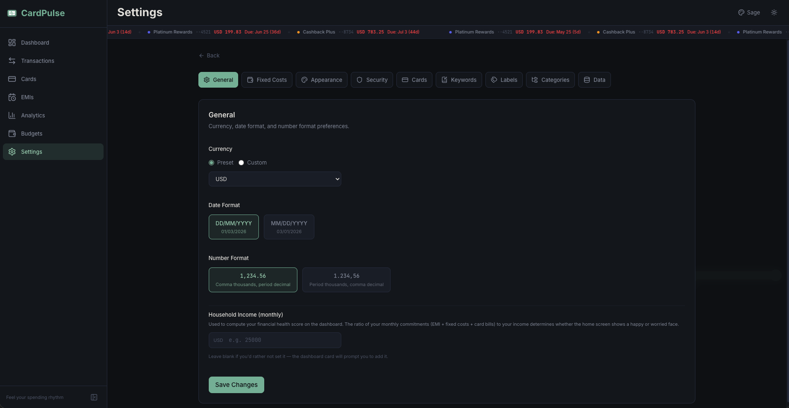
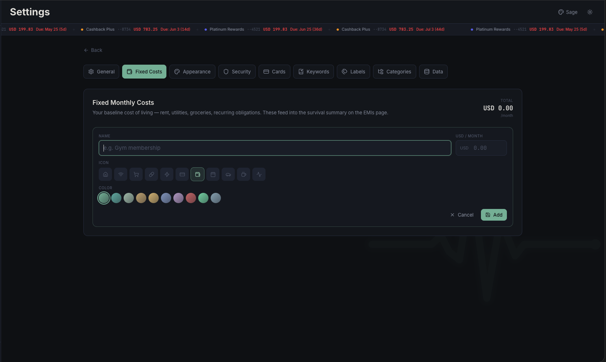
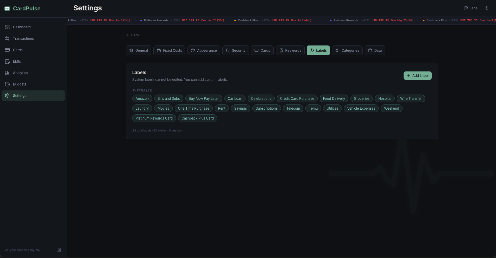
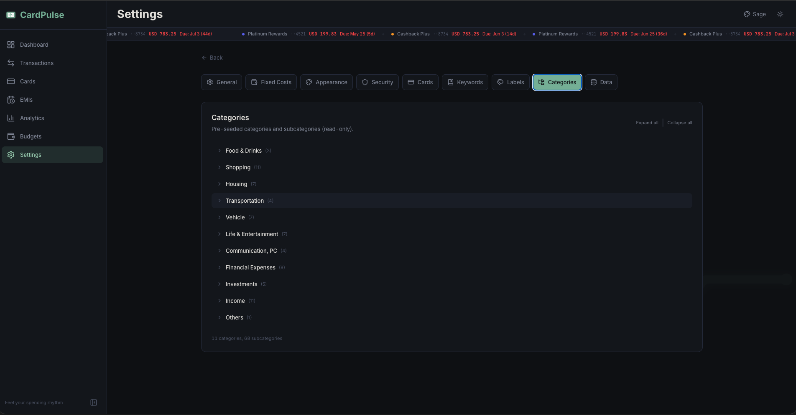
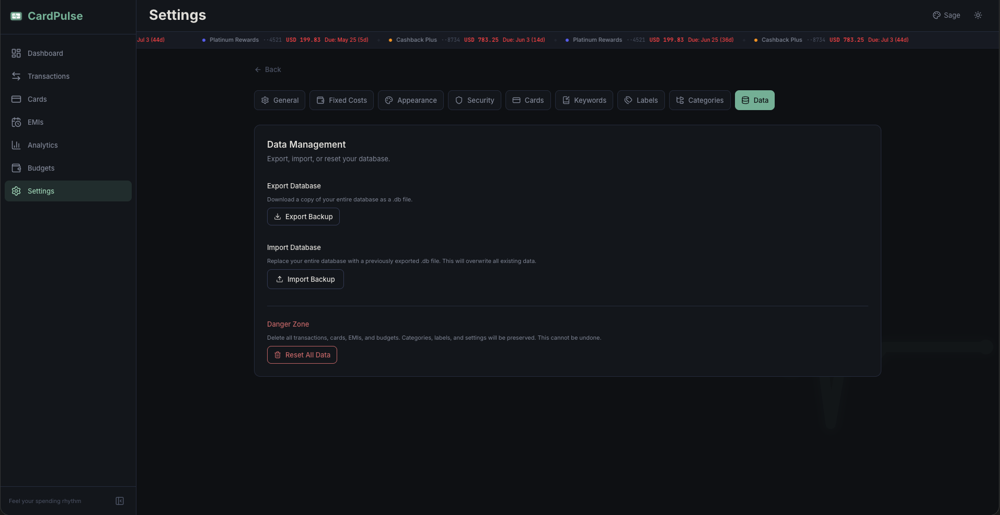

## CardPulse Documentation

<a href="../README.md">← Back to overview</a>

---

# ⚙️ 08: Settings Reference

> Complete guide to all 9 settings sections — configure currency, fixed costs, themes, security, keywords, labels, categories, and database management.

---

## 📑 Table of Contents

- [Overview](#-overview)
- [1. General](#1--general)
- [2. Fixed Costs](#2--fixed-costs)
- [3. Appearance](#3--appearance)
- [4. Security](#4--security)
- [5. Cards](#5--cards)
- [6. Keywords](#6--keywords)
- [7. Labels](#7--labels)
- [8. Categories](#8--categories)
- [9. Data Management](#9--data-management)

---

## 🗺️ Overview

The Settings page (`/settings`) uses a **horizontal pill-based navigation** with 9 sections. Each section manages a different aspect of the application.

**Key facts:**

- ⚡ Settings changes take effect **immediately** — no restart or page reload required
- 💾 All settings are stored in the SQLite database (`settings` table)
- 🔄 Settings are preserved when you reset transactional data
- 📦 Settings are included in database backups and restored from imports

---

## 1. 🌐 General

> Currency, date format, number format, and household income for the Financial Health card.

---

### 💱 Currency

Choose the currency code displayed throughout the app — in amounts, charts, exports, and the payment ticker.

Two modes:

- **Preset** — pick from a built-in dropdown of common codes (USD, EUR, GBP, INR, AED, SAR and others).
- **Custom** — type any 3-letter code. Useful for currencies not in the preset list.

**Default:** USD. The 3-letter code is what the UI renders next to every number; CardPulse does not perform currency conversion.

> ⚠️ **Important:** Changing the currency only affects the **display label** — it does not convert existing amounts. All amounts remain stored as raw numbers in the database. If you switch from USD to EUR, a `200` transaction simply re-renders as `EUR 200` instead of `USD 200`.

---

### 📅 Date Format

Choose how dates are displayed throughout the app:

| Option | Example | Convention |
|--------|---------|------------|
| **DD/MM** | 20/05/2026 | UK / EU / most-of-the-world standard (default) |
| **MM/DD** | 05/20/2026 | US standard |

---

### 🔢 Number Format

Choose how numbers (amounts) are formatted:

| Option | Example | Convention |
|--------|---------|------------|
| **1,234.56** | Comma thousands, period decimal | US / UK / most international (default) |
| **1.234,56** | Period thousands, comma decimal | Most-of-Europe standard |

---

### 💵 Household Income (monthly)

Optional. The single number that drives the **Financial Health Card** on the dashboard. The card divides your monthly commitments (next-cycle card bills + fixed costs) by this number and maps the ratio to a six-level mood face.

- Leave blank to hide the Financial Health Card entirely (the card surfaces a *Set income* CTA in that state).
- Stored locally like every other setting — it never leaves your machine.
- Update any time; the dashboard re-computes on next mount.

See [13: Financial Health Card](./13-Financial-Health.md) for the full ratio-to-mood mapping.

---

## 2. 🏠 Fixed Costs

> Your baseline cost of living — rent, utilities, recurring obligations — captured as monthly amounts. Feeds the Survival Summary and the Financial Health Card.

### Why it exists

The dashboard's Financial Health Card and the EMI page's Survival Summary both need to know what you *must* pay every month, regardless of discretionary spending. Fixed Costs is where that ground truth lives.

### Adding a fixed cost

Click **+ Add fixed cost** to open the inline form:

| Field | Required | Description |
|:------|:--------:|:------------|
| 🏷️ **Name**          | ✅ | e.g. *Rent*, *Internet*, *Health insurance* |
| 💰 **Monthly amount** | ✅ | In your configured currency |
| 🎨 **Icon**           | ✅ | One of 11 preset Lucide icons (Home, Wifi, Zap, Pill, etc.) |
| 🌈 **Color**          | ✅ | One of 10 preset accent colors |

A running **Total / month** appears at the top-right and updates live as you add, edit and remove entries.

### Editing and deleting

Each row in the list has inline **Edit** and **Delete** affordances. Deleting is irreversible at the row level, but every change is recorded as part of the DB you can back up — see [Data Management](#9--data-management) for full safety nets.

### Keep them honest

Fixed Costs only works if the inputs are the **floor**, not your typical spend. Things like *"I might travel next month"* don't belong here — that's discretionary. The list should be roughly equal to *"the minimum I owe each month even if I do nothing fun"*.

> 📖 Deep dive: [12: Survival Summary](./12-Survival-Summary.md)

---

## 3. 🎨 Appearance

> Theme and color mode settings — 6 themes x 2 modes = 12 visual combinations.

---

### 🎭 Color Themes (6 Options)

| Theme | Preview | Description |
|-------|---------|-------------|
| 🌿 **Sage** | Sage green + seafoam + sand | Default. Premium fintech aesthetic — think Linear meets Monzo. Calm, intentional, generous whitespace |
| 🌙 **Midnight** | Deep blues + cool grays | Cool-toned and professional. Evokes late-night productivity with a polished corporate edge |
| 🔮 **Cyberpunk** | Neon pink + cyan on black | High-contrast and bold. For those who want their finance app to feel like a sci-fi terminal |
| 🌋 **Molten** | Warm browns + amber + orange | Earthy and inviting. A warm hearth aesthetic that makes number-crunching feel cozy |
| 🔲 **Mono** | Pure grayscale | Clean and minimal. Zero color distraction — lets the data speak for itself |
| 💻 **Terminal** | Green-on-black CRT | Retro developer vibes. Monospace-everything aesthetic with phosphor glow effects |

Each theme defines its own complete set of:
- 🎨 Accent colors (primary, secondary, tertiary)
- 📊 Chart colors (8-color palette)
- 🏗️ Background layers (base, surface 1/2/3)
- 🚦 Status colors (success, warning, danger)
- 📝 Text colors (primary, secondary, muted)

---

### 🌓 Color Mode

| Mode | Description |
|------|-------------|
| 🌑 **Dark** | Dark backgrounds with light text (default). Optimized for low-light environments |
| ☀️ **Light** | Light backgrounds with dark text. Better for bright environments or personal preference |

All 6 themes fully support both modes, giving you **12 unique visual combinations**.

> 💡 **Tip:** You can also switch themes and modes directly from the **header bar** using the palette dropdown and sun/moon toggle — no need to visit Settings every time.

---

### 🔧 How Themes Work

Themes are implemented via **CSS custom properties** on the `<html>` element:

1. Switching a theme updates the `data-theme` attribute (e.g., `data-theme="sage"`)
2. Switching a mode updates the `data-mode` attribute (e.g., `data-mode="dark"`)
3. These attributes trigger a cascade of CSS variable updates across 12 sets of variables (6 themes x 2 modes)
4. All components — including Recharts charts — read these variables and update **instantly**

A **flash-prevention script** in the root layout reads your saved preference from `localStorage` before React hydrates, preventing a white flash on page load.

---

## 4. 🔒 Security

> PIN lock screen protection — enable, disable, or change your PIN.

---

### 🔓 PIN Enable / Disable

Toggle whether the PIN lock screen appears when you open CardPulse.

**Disabling PIN:**
1. Toggle the PIN Protection switch to **off**
2. Enter your current PIN to confirm the action
3. CardPulse will auto-authenticate on load — no lock screen appears

**Enabling PIN:**
1. Toggle the PIN Protection switch to **on**
2. Set a new **4-6 digit PIN**
3. The lock screen will appear on your next visit

> 📝 **Note:** Disabling the PIN keeps your PIN hash in the database — it's simply skipped during authentication. Re-enabling requires setting a new PIN.

---

### 🔄 Change PIN

To change your existing PIN:

1. Enter your **current PIN** for verification
2. Enter your **new PIN** (4-6 digits)
3. The old hash is replaced with the new bcrypt hash

**Security details:**

- 🔐 PIN is stored as a **bcrypt hash** — never in plaintext
- 🚫 **3 wrong attempts** trigger a 30-second cooldown with countdown
- 🍪 Session persists via httpOnly cookie until the browser tab closes
- 🎲 Session tokens are cryptographically random UUIDs

---

## 5. 💳 Cards

> Quick access to card management.

This section provides a convenient shortcut to the full **Cards page** for viewing, adding, and editing your credit cards. All card management actions are performed on the dedicated Cards page.

For complete details on card fields, billing cycles, aliases, and credit utilization, see [Card Management](./04-Card-Management.md).

---

## 6. 🔑 Keywords

> Manage the keyword rules that power the NLP parser's auto-categorization.

---

### 👁️ Viewing Rules

See all keyword rules (system + user-created) in a searchable table:

| Column | Description |
|--------|-------------|
| 🔤 **Keyword** | The text pattern to match (e.g., "enoc", "starbucks", "gym") |
| 📂 **Category** | Mapped main category (e.g., Vehicle) |
| 📁 **Subcategory** | Mapped subcategory (e.g., Fuel) |
| 🏷️ **Labels** | Labels auto-applied on match (e.g., "Vehicle Expenses") |
| 🔧 **Type** | System (pre-seeded, protected) or User (custom, deletable) |
| ⬆️ **Priority** | Higher priority rules are checked first |

---

### ➕ Adding Rules

Create a new keyword rule by specifying:

1. **Keyword** — the text to match (e.g., "gym")
2. **Category** — target category (e.g., "Shopping")
3. **Subcategory** — target subcategory (e.g., "Health and Beauty")
4. **Labels** — optional labels to auto-apply

User-created rules automatically receive **higher priority** than system rules, ensuring your customizations always take precedence.

---

### 🗑️ Deleting Rules

- ✅ **User-created rules** can be deleted freely
- 🔒 **System rules** (91 pre-seeded rules) are protected and cannot be removed

---

### 🧪 Testing Keywords

Type a test phrase into the keyword tester to see what the NLP parser would match it to — **without creating a transaction**. This is useful for:

- Verifying new rules work as expected
- Debugging unexpected categorizations
- Understanding why a Quick Add parse produced certain results

> 💡 **Tip:** Rules created via the "Learn this?" prompt during Quick Add also appear here and can be managed like any user-created rule. See [Transaction Entry](./03-Transaction-Entry.md) for details on the learning system.

---

## 7. 🏷️ Labels

> Manage transaction labels — system labels are protected, custom labels are yours to create.

---

### 🔒 System Labels

Pre-seeded labels that **cannot** be edited or deleted. These include:

| Category | Labels |
|----------|--------|
| 📂 **Category labels** | Amazon, Bills and Subs, Food Delivery, Groceries, Hospital, India Transfers, Laundry, Movies, Nicotine Gum, Rent, Savings, Shisha, Spa, Subscriptions, Temu, Utilities, Vehicle Expenses |
| 🏷️ **Special labels** | Buy Now Pay Later, Car Loan, Celebrations, One Time Purchase, Tabby, Telecom, Weekend |

> 💡 **Card labels** are created automatically when you add a credit card. Each card gets a matching label for transaction tagging.

---

### ✨ Custom Labels

Add your own labels for personalized transaction tagging:

- 🆕 Must have **unique names** (no duplicates with existing system or custom labels)
- 🗑️ Can be **deleted** when no longer needed
- 📝 Appear in the **label selector** when creating or editing transactions
- 📊 Show up in analytics charts and export reports

---

## 8. 📂 Categories

> A read-only reference view of the complete category tree.

**11 main categories** with **68 subcategories** are displayed in a hierarchical tree view. Categories and subcategories are pre-seeded during first run and **cannot be modified** — they provide the fixed organizational structure for all transactions.

| # | Category | Subcategory Count |
|---|----------|-------------------|
| 1 | 🍽️ Food & Drinks | 3 |
| 2 | 🛍️ Shopping | 11 |
| 3 | 🏠 Housing | 7 |
| 4 | 🚌 Transportation | 4 |
| 5 | 🚗 Vehicle | 7 |
| 6 | 🎭 Life & Entertainment | 7 |
| 7 | 📱 Communication, PC | 4 |
| 8 | 💰 Financial Expenses | 8 |
| 9 | 📈 Investments | 5 |
| 10 | 💵 Income | 10 |
| 11 | 📦 Others | 1 |

For the complete subcategory listing, see [Architecture Overview](./10-Architecture-Overview.md).

---

## 9. 💾 Data Management

> Database backup, restore, and reset functions.

---

### 📤 Export Backup

Download your entire SQLite database as a `.db` file.

**What's included:**
- ✅ All transactions and their label associations
- ✅ Cards and billing cycle configurations
- ✅ EMIs and their progress data
- ✅ Budgets
- ✅ Cycle payment records (mark-paid history)
- ✅ Settings (currency, theme, PIN, etc.)
- ✅ Labels (system + custom)
- ✅ Keyword rules (system + user-created)
- ✅ Categories and subcategories

**File naming:** `cardpulse-backup-YYYY-MM-DD.db`

> 💡 **Tip:** Export a backup regularly, especially before importing data or resetting. The backup file is a complete, self-contained copy of your entire CardPulse database.

---

### 📥 Import Backup

Upload a previously exported `.db` file to restore your data.

**How it works:**
1. Select a `.db` backup file from your device
2. The current database is **replaced entirely** with the uploaded file
3. The page must be reloaded for changes to take effect

> ⚠️ **Warning:** Importing a backup **replaces ALL current data** — transactions, cards, EMIs, budgets, settings, everything. The current database is completely overwritten.

> 🛡️ **Safety tip:** Always export a backup of your current data **before** importing. This gives you a way to restore if the import doesn't contain what you expected.

---

### 🔄 Reset Data

Delete all transactional data while keeping your configuration intact.

**🗑️ What gets DELETED:**

| Data | Description |
|------|-------------|
| 📝 Transactions | All transaction records and their label associations |
| 💳 Cards | All credit card configurations |
| 📦 EMIs | All installment plans and progress data |
| 🎯 Budgets | All monthly budget limits |
| 💰 Cycle Payments | All mark-paid records |

**✅ What gets PRESERVED:**

| Data | Description |
|------|-------------|
| 📂 Categories & Subcategories | The 11 categories and 68 subcategories |
| 🏷️ Labels | All system and custom labels |
| 🔑 Keyword Rules | All system and user-created NLP rules |
| ⚙️ Settings | Currency, theme, PIN, date/number format, etc. |

> ⚠️ **Warning:** Reset is **irreversible**. There is no undo. Export a backup first if you might want to recover the data later.

After reset, CardPulse behaves like a fresh install with your preferences intact — you'll need to re-add your credit cards and start entering transactions from scratch.

---

| | |
|---|---|
| ← Previous: [Budgets](./07-Budgets.md) | → Next: [Export Reports](./09-Export-Reports.md) |
