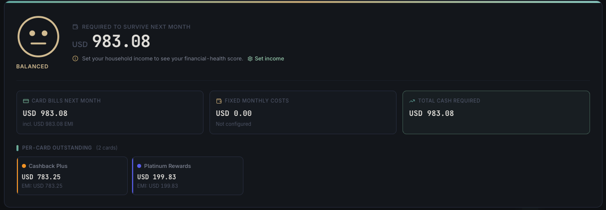

<div align="center">

<a href="../README.md">
  
</a>

## CardPulse Documentation

<sub><a href="../README.md">← Back to overview</a></sub>

</div>

---

# 💚 13: Financial Health Card

> A single card at the top of your dashboard that answers *"how am I doing this month?"* using a six-level mood face — from **Thriving** to **Underwater** — based on the ratio of your monthly commitments to your monthly income.

---



The full-context shot of the same card sitting at the top of the dashboard (with the Monthly Hero below) lives in [02: Dashboard Guide](./02-Dashboard-Guide.md#-financial-health-card).

---

## 📑 Table of Contents

- [What It Shows](#-what-it-shows)
- [The Mood Scale](#-the-mood-scale)
- [How the Ratio is Calculated](#-how-the-ratio-is-calculated)
- [Card Layout](#-card-layout)
- [Setting Your Income](#-setting-your-income)
- [Per-Card Outstanding Grid](#-per-card-outstanding-grid)
- [Theme Adaptation](#-theme-adaptation)
- [Empty States](#-empty-states)

---

## 💡 What It Shows

The Financial Health Card lives **above the Monthly Hero** on the dashboard. It distills your current month's obligations into one expressive face plus three supporting numbers, so you can read your financial pulse at a glance — without doing any mental math.

The card answers three questions:

| Question | Answered by |
|---------|-------------|
| 🌡️ *How tight is this month?* | The mood face + sentiment label |
| 💵 *What do I owe in total?* | The "Commitments" number |
| 💳 *Where is it concentrated?* | The per-card outstanding grid |

---

## 😊 The Mood Scale

The card uses a custom **6-level line-drawn emoji** that adapts to any theme. Each level is keyed to a `debt / income` ratio:

| Mood | Label | Ratio Band | Meaning |
|:----:|-------|:---------:|---------|
| 😄 | **Thriving** | `< 30%` | Plenty of breathing room |
| 🙂 | **Comfortable** | `30 – 50%` | You're in good shape |
| 😐 | **Balanced** | `50 – 70%` | Manageable, but watch new debt |
| 😟 | **Tight** | `70 – 90%` | Margins are tight |
| 😢 | **Stretched** | `90 – 100%` | Almost no buffer left |
| 😭 | **Underwater** | `> 100%` | Commitments exceed income — action needed |

The face is **drawn from SVG primitives** — no emoji fonts. Strokes use `currentColor`, so the face automatically inherits the theme's semantic color (success / warning / danger).

> 💧 **Underwater** mood adds a subtle pulse animation to draw the eye.

---

## 🧮 How the Ratio is Calculated

```
totalCommitments = sum(currentCycleEstimatedBill across all cards)
                 + sum(monthlyAmount across all fixed-cost entries)

ratio = totalCommitments / monthlyHouseholdIncome
```

EMI installments are **not** double-counted — they are already part of each card's cycle bill, so adding card bills + fixed costs gives the complete picture. The EMI total is surfaced as an informational sub-line ("incl. *X* in EMIs") rather than a separate bucket.

If `monthlyHouseholdIncome` is `0` or unset, the card shows an empty state asking you to configure it.

---

## 🎨 Card Layout

The card is composed of three rows:

### Row 1 — Mood + Headline
The big face sits on the left at 80px. To its right are the mood label (*"Tight"*), the explanatory copy (*"75% of income is committed. Margins are tight."*), and a small percent badge.

### Row 2 — Composition
Three pill-shaped chips show the breakdown:

- 💳 **Card bills:** *X*
- 🏠 **Fixed costs:** *Y*
- 🔁 **EMIs (informational):** *Z*

The bills and fixed costs sum to the total commitments. The EMI chip is greyed out and prefixed *"incl."* to make clear it's a subset of the card bills, not an additional bucket.

### Row 3 — Per-Card Outstanding Grid
See [Per-Card Outstanding Grid](#-per-card-outstanding-grid) below.

---

## 💵 Setting Your Income

The Financial Health Card requires a **monthly household income** number to compute the ratio. Configure it in:

> ⚙️ **Settings → General → Household Income (monthly)**

The value is stored as a single setting (`household_income`) and is treated as a number in your **configured currency**. It is optional — leave it blank to hide the financial-health card entirely.

> 🔒 **Privacy:** Like every other CardPulse setting, this number lives only in your local SQLite database. It never leaves your machine.

You can update the number any time, and the card recalculates on the next dashboard mount.

---

## 💳 Per-Card Outstanding Grid

The bottom of the card is a responsive grid of small **per-card outstanding** tiles. Each tile shows:

| Element | Description |
|---------|-------------|
| 🏦 **Card name + last 4** | Identifies the card |
| 💸 **Current cycle bill** | What you owe on this card's current billing cycle |
| 🔁 **EMI sub-line** | If the card has running EMIs, shows their monthly contribution |
| 🟢 **Paid badge** | Appears if the current cycle is already marked paid |

Tiles are color-tinted with the card's own accent color (a 10% alpha background). The grid auto-wraps based on viewport width — 1 column on mobile, up to 4 on wide screens.

---

## 🎨 Theme Adaptation

Both the mood face and the entire card are **fully theme-aware**. Every color is read from CSS custom properties — no hardcoded hex values — so the card looks native across all six built-in themes:

| Theme | Mood face uses |
|-------|----------------|
| 🌿 Sage | `text-sage-300` / `text-success` / `text-warning` / `text-danger` |
| 🌙 Midnight | Same tokens, darker backdrop |
| 🌆 Cyberpunk | Neon variants |
| 🌋 Molten | Warm variants |
| ⚪ Mono | Grayscale variants |
| 💻 Terminal | Terminal-green variants |

The face's strokes are drawn with `stroke="currentColor"`, so changing the surrounding text color (via the mood-level → token mapping) immediately retints the entire face. No theme branching in the SVG itself.

---

## 🧭 Empty States

| Situation | What the card shows |
|----------|--------------------|
| 🚫 No cards added yet | Card is hidden entirely (handled by `cardCycleData.length > 0` check) |
| 🚫 Income not set | A neutral face + *"Set your household income to see your financial-health score"* CTA linking to Settings → General |
| 🚫 No fixed costs set | The fixed-cost chip shows `0` — no error, just a clean read |
| 🚫 No EMIs running | The EMI chip is hidden |

---

## 🔗 Related

- [🌱 12: Survival Summary](./12-Survival-Summary.md) — the companion EMI-page view that uses the same income/fixed-costs data
- [📊 02: Dashboard Guide](./02-Dashboard-Guide.md) — where this card lives
- [⚙️ 08: Settings Reference](./08-Settings-Reference.md) — full reference for the Household Income field
